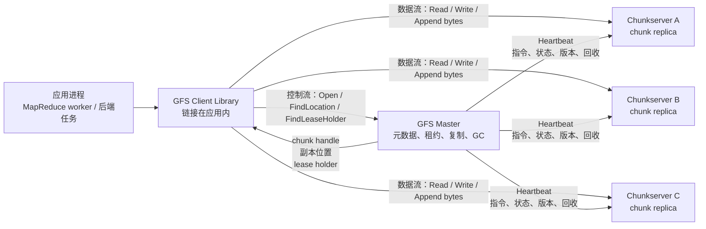
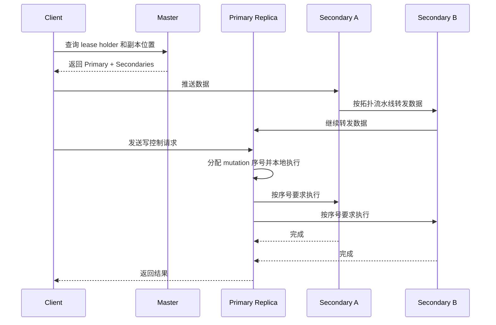

# 《The Google File System》

本文档面向已经熟悉 Linux 系统编程、网络编程、Go/C++ 后端开发，但刚开始学习分布式存储的读者。内容按论文正文逻辑意群翻译和讲解，跳过 `Acknowledgments` 和 `References`。

说明：下面的“精准翻译”采用忠实意译方式，保留论文技术含义和论证顺序；“导师解读”和“后端类比”用于把论文设计落到工程实践中。

## 0. 先把 GFS 的架构图刻进脑子

GFS 的核心不是“远程文件系统”这么简单，而是一个为 Google 早期大规模数据处理定制的分布式存储系统。它的基本拆分是：

- `Client`：链接到应用进程里的 GFS 客户端库，负责把文件 API 调用翻译成对 Master 和 Chunkserver 的 RPC。
- `Master`：中心化元数据管理者，管理命名空间、文件到 chunk 的映射、chunk 副本位置、租约、垃圾回收、复制和迁移策略。
- `Chunkserver`：真正保存数据的机器。每个 chunk 在本地 Linux 文件系统里就是普通文件。

最重要的第一性原理：

- Master 管“元数据和决策”，不搬运普通文件数据。
- Client 拿到 chunk 位置后，直接和 Chunkserver 传输数据。
- Chunk 很大，默认 64MB，所以 Master 查询频率被压低。
- 写入时，一个副本会被 Master 授予 Lease，成为 Primary，由它给并发变更排序。

如果用 Linux 文件系统类比：

- Master 像一个分布式版的 inode / dentry / block mapping 管理层，但它不在内核 VFS 里，而是一个用户态中心服务。
- Chunkserver 像真正持有 block 的磁盘服务器，不过它保存的是 64MB 级别的大块。
- Client library 像用户态 VFS shim，应用以文件 API 思考，底层通过 RPC 找元数据和搬数据。

如果用 Redis 类比：

- Master 的内存元数据类似 Redis 的内存状态。
- Operation log 类似 AOF，Checkpoint 类似 RDB 快照。
- 单 Master 的顺序元数据更新类似 Redis 单线程命令执行模型：牺牲一部分分布式复杂度，换来状态机简单、顺序清楚。

## 1. 核心专有名词

### Chunk（分块）

GFS 把文件切成固定大小 chunk，默认 64MB。每个 chunk 有一个全局唯一、不可变的 64 位 chunk handle。

工程理解：不要把它类比成 Linux 里的 4KB block。GFS 的 chunk 更像“分布式对象存储里的大对象分片”。chunk 大，Master 管理的元数据就少，客户端向 Master 查询位置的频率也低。

### Chunkserver

Chunkserver 是保存 chunk 副本的服务器。它把 chunk 当作本地 Linux 文件保存，读写时按 `chunk handle + byte range` 定位。

工程理解：Chunkserver 不是裸盘控制器，它是用户态服务。底层仍借助 Linux 文件系统和 buffer cache。

### Master

Master 管理所有文件系统元数据和全局控制活动，例如：

- 文件命名空间；
- 文件到 chunk 的映射；
- chunk 副本位置；
- lease 分配；
- 垃圾回收；
- 重新复制；
- rebalancing；
- stale replica 检测。

工程理解：Master 是控制面，不是数据面。很多人初读 GFS 会担心单 Master 必然成为瓶颈，但 GFS 的设计目标就是让 Master 不碰大数据流。

### Lease（租约）

Lease 是 Master 授予某个 chunk 副本的临时写入排序权。持有 lease 的副本叫 Primary，其他副本叫 Secondary。

工程理解：Lease 像一个带过期时间的分布式锁，但它不是给应用用的锁，而是文件系统内部用于给 mutation 排序的权限。过期时间让系统在 Primary 失联后不需要做复杂判断，只要等 lease 到期就可以安全换 Primary。

### Mutation（变更操作）

Mutation 指会改变 chunk 内容或元数据的操作，例如普通 write 和 record append。

工程理解：读操作不需要排序，写操作需要排序。GFS 让 Primary 对同一个 chunk 的 mutation 分配序号，所有副本按同一序号执行。

### Heartbeat（心跳）

Master 和 Chunkserver 定期交换 Heartbeat。Heartbeat 不只是“你还活着吗”，还携带状态、指令、lease 延期、垃圾回收信息等。

工程理解：在 Go 后端服务里，你可能会用健康检查判断节点是否在线；GFS 的 Heartbeat 更像控制面协议，既探活又下发任务。

### Control Flow 与 Data Flow 分离

Control Flow 是元数据、租约、排序、确认等控制消息；Data Flow 是真正的字节数据传输。

GFS 的核心优化是：控制流经过 Master 或 Primary，数据流沿网络拓扑在 Client 和 Chunkserver 间直接传递。

后端类比：这类似一个高并发 Go 服务把“控制请求”和“大 payload 传输”拆开。控制 RPC 走服务发现和元数据服务，大文件传输走对象存储节点间的直接流。

## 2. Abstract 摘要

> **精准翻译**  
> 作者设计并实现了 Google File System，一个面向大规模分布式数据密集型应用的可扩展分布式文件系统。它运行在廉价通用硬件上，同时提供容错能力，并能向大量客户端提供较高总体吞吐。虽然 GFS 和已有分布式文件系统一样追求性能、可扩展性、可靠性和可用性，但它的设计来自 Google 自身工作负载和技术环境的观察，这些观察与传统文件系统假设明显不同。因此，作者重新审视传统设计，探索了新的设计点。GFS 已经广泛部署在 Google 内部，用于服务数据、研发数据和大规模数据处理。论文将介绍接口扩展、系统设计和真实测量结果。

**导师解读**  
摘要已经把 GFS 的工程哲学说完了：这不是为了兼容所有应用的通用文件系统，而是为了 Google 的大规模数据处理 workload 定制的系统。它的设计不是从“文件系统应该是什么”出发，而是从“我们的数据如何被读写、机器如何失败、应用能否配合”出发。

**后端类比**  
这就像你不会用同一套后端架构同时服务 IM 聊天、离线报表和高频交易。GFS 是为离线/批处理/大数据流而生，目标是高吞吐、可恢复、可横向扩展，而不是微秒级低延迟。

## 3. Introduction 引言

### 3.1 设计动机：传统假设失效

> **精准翻译**  
> GFS 是为了满足 Google 快速增长的数据处理需求而设计。它追求传统分布式文件系统同样关心的性能、扩展性、可靠性和可用性，但设计依据来自 Google 的应用负载和技术环境。作者发现，这些负载和环境已经偏离早期文件系统假设，因此需要重新考虑传统设计选择。

**导师解读**  
系统设计最怕脱离 workload。GFS 的很多选择初看“不标准”：不兼容 POSIX、单 Master、大 chunk、弱一致性。但如果把 workload 放在前面，这些选择就不奇怪。

**Linux 类比**  
传统 Linux 文件系统要面对各种小文件、随机写、rename、mmap、fd 语义、权限模型。GFS 不想做这个复杂全集，它只服务 Google 内部大数据处理应用。

### 3.2 故障是常态

> **精准翻译**  
> 第一，组件故障是常态而不是例外。系统由大量廉价机器和部件构成，任意时刻都有组件不可用，部分故障甚至无法恢复。作者见过应用 bug、操作系统 bug、人为错误，以及磁盘、内存、网络、电源等硬件故障。因此，监控、错误检测、容错和自动恢复必须是系统内建能力。

**导师解读**  
分布式系统规模上来以后，故障概率会从“偶尔遇到”变成“持续发生”。GFS 不追求让每台机器可靠，而是让系统在机器不可靠的前提下可靠。

**后端类比**  
如果你写过 Go 微服务集群，就知道单实例崩溃不可怕，可怕的是没有健康检查、重试、熔断、服务发现和自动恢复。GFS 把这些思想用在存储层。

### 3.3 文件巨大，小文件不是优化目标

> **精准翻译**  
> 第二，文件按照传统标准非常巨大，多 GB 文件很常见。每个文件通常包含大量应用对象，例如网页文档。与其管理数十亿 KB 级小文件，不如管理较少数量的大文件。因此，I/O 操作大小、block size 等参数必须重新审视。

**导师解读**  
这直接推出 64MB chunk。传统文件系统用小 block 是为了空间利用和随机访问；GFS 文件巨大、顺序处理多，元数据规模才是更关键的问题。

**Linux 类比**  
如果 Linux 文件系统里每个网页文档都是一个 inode，十亿对象就意味着十亿 inode 和目录项，元数据压力巨大。GFS 更像把许多小对象打包进大 segment，再在应用层维护记录边界。

### 3.4 追加为主，覆盖写很少

> **精准翻译**  
> 第三，大多数文件通过追加新数据修改，而不是覆盖已有数据。文件写完后通常只被读取，且多为顺序读取。这类数据包括大型分析仓库、持续生成的数据流、归档数据和中间结果。因此，在大文件上，追加成为性能优化和原子性保证的重点，而客户端数据缓存吸引力下降。

**导师解读**  
这段是 GFS 的灵魂。追加写让系统可以避免大量随机覆盖写复杂性；顺序读让大 chunk 和无客户端数据缓存变得合理。

**后端类比**  
这很像日志型系统：Kafka segment、WAL、LSM-tree 的 SSTable 都偏向 append。你用 append 换来了顺序 I/O、恢复简单和并发控制简单。

### 3.5 应用和文件系统共同设计

> **精准翻译**  
> 第四，应用和文件系统 API 共同设计能增加整体灵活性。例如，GFS 放松一致性模型来简化文件系统，同时不给应用造成沉重负担；它还提供原子追加，让多个客户端能并发向同一文件追加而不需要额外同步。

**导师解读**  
GFS 成功的前提是 Google 同时控制应用和存储。应用愿意遵守 GFS 的模式：追加、checkpoint、自校验记录、去重。这让文件系统可以不提供昂贵的强 POSIX 语义。

**Redis 类比**  
Redis 的很多能力来自“数据在内存、命令单线程顺序执行”这个约束。GFS 的能力来自“应用主要 append、能接受弱一致、能配合去重”这些约束。

## 4. Design Overview 设计概览

### 4.1 Assumptions 系统假设

> **精准翻译**  
> GFS 的设计假设包括：系统由大量经常失败的廉价组件构成；系统存储数量适中的大文件，小文件支持但不优化；读负载主要是大规模流式读和少量小随机读；写负载主要是大规模顺序追加；系统必须高效支持多个客户端并发追加到同一文件；高持续带宽比低延迟更重要。

**导师解读**  
这组假设是 GFS 全文的地基。每一个设计都能从这里找到理由：

- 廉价组件常失败，所以要复制、校验、自动恢复。
- 大文件为主，所以 chunk 可以很大。
- 顺序读写多，所以关注吞吐而不是单次延迟。
- 并发追加多，所以提供 record append。
- 小随机写不重要，所以不为它牺牲整体设计。

**后端类比**  
这类似你做后端容量设计时先确认 QPS、请求大小、读写比例、P99 延迟目标、失败模型。没有这些参数，谈架构没有意义。

### 4.2 Interface 接口

> **精准翻译**  
> GFS 提供熟悉的文件系统接口，但不实现 POSIX 标准 API。文件按目录组织，用路径名标识，支持创建、删除、打开、关闭、读、写。此外，GFS 提供 snapshot 和 record append。Snapshot 低成本复制文件或目录树；record append 允许多个客户端并发追加到同一文件，并保证每个客户端的追加是原子的。

**导师解读**  
GFS 保留“文件路径”这个易用抽象，但不背负完整 POSIX 语义。它额外提供 snapshot 和 record append，因为这是 Google 数据处理真正需要的能力。

**Linux 类比**  
POSIX 要求很多细粒度语义，例如 close-to-open、rename、append、mmap、权限等。GFS 像是用户态文件系统 API，但选择性实现语义，不接 Linux VFS vnode 层。

### 4.3 Architecture 架构

> **精准翻译**  
> 一个 GFS 集群包含一个 Master 和多个 Chunkserver，并被多个 Client 访问。文件被切成固定大小的 chunk，每个 chunk 有 Master 分配的全局唯一 handle。Chunkserver 把 chunk 存为本地 Linux 文件。默认每个 chunk 有三个副本，用户可为命名空间不同区域设置不同复制级别。Master 保存所有元数据，包括命名空间、访问控制、文件到 chunk 的映射、chunk 位置，并管理 lease、垃圾回收和迁移。Client 与 Master 交互元数据，与 Chunkserver 直接传输数据。Client 和 Chunkserver 都不缓存文件数据，但 Client 缓存元数据，Chunkserver 依赖 Linux buffer cache。

**导师解读**  
这是 GFS 的核心架构段。Master 是控制面，Chunkserver 是数据面。Client 先问 Master“数据在哪”，再直接去 Chunkserver 读写“数据本身”。

**后端类比**  
像一个服务发现系统：注册中心告诉你服务实例在哪，但请求数据不经过注册中心。Master 类似注册中心 + 元数据状态机 + 调度器；Chunkserver 类似真正的业务实例。

**一致性提示**  
Client 缓存元数据会带来短时间 stale 风险。GFS 接受这个风险，并用超时、文件 reopen、版本号和应用语义处理它。

### 4.4 Single Master 单 Master

> **精准翻译**  
> 单 Master 极大简化设计，使 Master 能利用全局知识做复杂 chunk 放置和复制决策。但必须减少 Master 对读写的参与，避免成为瓶颈。Client 不通过 Master 读写数据，而是询问 Master 应联系哪些 Chunkserver，缓存这些信息，并直接与 Chunkserver 交互。一次简单读中，Client 根据文件名和 offset 算出 chunk index，向 Master 请求 chunk handle 和副本位置，然后向最近副本读取。Client 可缓存 chunk 信息，也可一次请求多个 chunk，Master 顺带返回后续 chunk 信息以减少未来交互。

**导师解读**  
单 Master 是 GFS 最有争议、也最漂亮的取舍。它用中心化换来了元数据一致性和实现简单，用大 chunk、缓存和数据面直连避免瓶颈。

**Redis 类比**  
Redis 单线程并不是不能高性能，因为它把操作放在内存里，并避免复杂锁竞争。GFS 单 Master 也不是必然慢，因为 Master 的工作集小、请求轻、数据不经过它。

### 4.5 Chunk Size 分块大小

> **精准翻译**  
> GFS 选择 64MB chunk，远大于传统文件系统 block。Chunk 副本作为普通 Linux 文件保存，只在需要时扩展，避免内部碎片浪费。大 chunk 减少 Client 与 Master 的交互，提升 TCP 连接复用，并减少 Master 元数据大小，使元数据可放在内存中。缺点是小文件可能产生热点；实践中这不常见，因为应用主要读大型多 chunk 文件。早期批处理系统曾因大量机器同时读取单 chunk 可执行文件而产生热点，后来通过提高复制因子和错峰启动缓解。

**导师解读**  
64MB chunk 是 GFS 的“反传统”设计，但它服务于大文件、大吞吐。它降低 Master 压力，也让单 Master 可行。

**Linux 类比**  
Linux block 小是为了通用性；GFS chunk 大是为了减少分布式元数据和 RPC。可以把 chunk 理解成 ext4 block group 或对象存储 part，而不是 4KB block。

### 4.6 Metadata 元数据

> **精准翻译**  
> Master 保存三类元数据：文件和 chunk 命名空间、文件到 chunk 的映射、chunk 副本位置。所有元数据保存在内存中。前两类通过操作日志持久化到本地磁盘并复制到远端；chunk 位置信息不持久化，而是在 Master 启动或 Chunkserver 加入时向 Chunkserver 查询。

**导师解读**  
GFS 区分“必须持久化的真状态”和“可以重建的派生状态”。命名空间和文件到 chunk 的映射丢了，文件系统就没了；chunk 位置可以从 Chunkserver 上报重建。

**Linux 类比**  
Master 的命名空间像 inode/dentry 元数据；chunk 位置像 block mapping。但 GFS 不把 chunk location 当永久真相，因为磁盘上实际有什么，Chunkserver 最清楚。

### 4.7 In-Memory Metadata 内存元数据

> **精准翻译**  
> 元数据在内存中使 Master 操作很快，也方便后台周期性扫描整个状态，用于垃圾回收、故障后的重新复制和负载/空间均衡。内存容量不是严重限制：每个 64MB chunk 只需少量元数据，多数 chunk 是满的；文件名也通过前缀压缩保存。如果需要更大规模，给 Master 增加内存相比引入复杂设计更划算。

**导师解读**  
这是典型工程判断：用内存换复杂度。只要 workload 保证文件大、chunk 数量可控，单机内存就足够管理很大集群。

**Redis 类比**  
Redis 把数据放内存，换来简单快速；GFS Master 把元数据放内存，换来元数据操作和后台扫描快速。

### 4.8 Chunk Locations 副本位置

> **精准翻译**  
> Master 不持久保存 chunk 副本位置信息，而是在启动时轮询 Chunkserver。这样比维护持久位置记录更简单，因为 Chunkserver 会频繁加入、离开、失败、重启或改名。真正知道自己磁盘上有哪些 chunk 的是 Chunkserver；试图在 Master 上持久维护完全一致视图没有意义。

**导师解读**  
这体现了“权威状态源”原则。不要持久化你无法保证真实的状态。副本位置是运行时事实，应该从实际持有者处恢复。

**后端类比**  
服务注册中心也可能不把所有 instance 状态当作永久事实，而是靠心跳和重新注册恢复。机器到底活不活，最终要看它自己是否上报和响应。

### 4.9 Operation Log 操作日志

> **精准翻译**  
> 操作日志记录关键元数据变更，是 GFS 的核心。它既是元数据的持久记录，也是定义并发操作顺序的逻辑时间线。由于日志关键，GFS 在元数据变更持久化前不会让变更对客户端可见。日志被复制到多台机器，Master 只有在本地和远端刷盘后才响应客户端。为减少恢复时间，Master 会在日志增长到一定大小时生成 checkpoint，恢复时加载最新 checkpoint，再重放之后的日志。Checkpoint 可并发生成，不阻塞新的 mutation。

**导师解读**  
这是状态机复制的基础思想：所有重要元数据变更都进入一个有序日志。只要日志可靠，Master 崩溃后就能重建状态。

**Redis 类比**  
Operation log 像 AOF，checkpoint 像 RDB。AOF 记录变更序列，RDB 缩短恢复时间。GFS 也是日志 + 快照组合。

## 5. Consistency Model 一致性模型

### 5.1 GFS 的保证

> **精准翻译**  
> GFS 采用放松的一致性模型，以便简单高效地支持高度分布式应用。文件命名空间 mutation 是原子的，由 Master 处理，命名空间锁保证原子性，操作日志定义全局顺序。数据 mutation 后文件区域状态取决于 mutation 类型、成功失败以及是否并发。若所有客户端从任何副本都看到相同数据，该区域是 consistent；若它 consistent 且包含某次 mutation 完整写入的数据，则是 defined。无并发干扰的成功写会产生 defined 区域；并发成功写可能产生 consistent but undefined 区域；失败写可能产生 inconsistent 区域。

**导师解读**  
GFS 的一致性术语要分清：

- `consistent`：副本之间一致，大家看到一样。
- `defined`：不仅一致，而且内容是应用可解释的完整写入结果。
- `consistent but undefined`：所有副本一样，但内容可能是多个并发写混合，应用不能假设其语义。
- `inconsistent`：不同副本可能看到不同数据。

**Linux 类比**  
POSIX 文件系统通常希望应用看到更强的写语义。GFS 明确告诉应用：普通并发 write 不提供你想象的强语义，如果你要多 writer 并发输出，请用 record append。

### 5.2 Write 与 Record Append

> **精准翻译**  
> 普通 write 把数据写到应用指定 offset。Record append 则让 GFS 选择 offset，并保证记录在并发 mutation 下至少原子追加一次。返回的 offset 标识一个包含该记录的 defined 区域。GFS 可能插入 padding 或重复记录，这些区域被视为 inconsistent，但通常远小于用户数据。

**导师解读**  
GFS 的强点不是让普通 write 在并发下强一致，而是提供一个更适合 workload 的新语义：record append。它牺牲 exactly-once，换取高并发追加吞吐和简单实现。

**一致性取舍**  
强一致版本可能要求全局锁、严格事务、回滚、幂等协议，成本高。GFS 选择 at-least-once + 应用去重，因为 Google 的数据处理任务天然能接受重复过滤。

### 5.3 应用如何适应弱一致性

> **精准翻译**  
> GFS 应用用几种简单技术适应一致性模型：依赖追加而不是覆盖、使用 checkpoint、写入自验证和自标识记录。典型 writer 从头到尾生成文件，完成后原子 rename 到永久名称，或周期性 checkpoint 已成功写入范围。Reader 只处理到最后 checkpoint 的区域。多 writer 并发追加时，每条记录带 checksum 和唯一 ID，Reader 用 checksum 丢弃 padding 和碎片，用唯一 ID 去重。

**导师解读**  
这就是 GFS 的应用契约：文件系统不保证一切，应用也不是完全裸奔。应用按日志式写入、checkpoint、checksum、record id 这套模式写，就能在弱一致底座上获得可接受的正确性。

**后端类比**  
消息队列常见 at-least-once 投递，消费者用业务 ID 去重。GFS record append 的语义非常类似：可能重复，但完整记录不会无声丢失。

## 6. System Interactions 系统交互

### 6.1 Lease 与 Mutation 顺序

> **精准翻译**  
> Mutation 是改变 chunk 内容或元数据的操作。每个 mutation 会在 chunk 的所有副本执行。GFS 使用 lease 在副本间维持一致 mutation 顺序。Master 把 chunk lease 授予某个副本作为 Primary，Primary 为所有 mutation 选择串行顺序，所有副本按该顺序执行。Lease 初始超时 60 秒，可通过 Heartbeat 延期。若 Master 与 Primary 失联，可在旧 lease 过期后安全授予新 lease。

**导师解读**  
Lease 是 GFS 写路径的核心。它把排序权从 Master 下放给 Primary，减少 Master 参与每次写。过期机制则避免 Primary 失联时系统永久卡住。

**Go/RPC 类比**  
可以想象一个 Go 服务集群里，leader 给某个 shard 的请求分配 sequence number，followers 按 sequence number 执行。GFS 的 Primary 就是 chunk 粒度的临时 leader。

### 6.2 普通写流程

> **精准翻译**  
> 写入时，Client 先询问 Master 当前 lease holder 和其他副本位置。Master 返回 Primary 和 Secondary，Client 缓存这些信息。Client 把数据推送给所有副本，各副本先放入内部 LRU buffer。所有副本确认收到数据后，Client 向 Primary 发送写请求。Primary 给 mutation 分配连续序号并本地执行，再把写请求转发给 Secondary，Secondary 按相同序号执行。Secondary 完成后回复 Primary，Primary 最后回复 Client。若部分副本失败，请求视为失败，相关区域可能 inconsistent，Client 会重试。

**导师解读**  
注意数据先到副本，控制请求后到 Primary。这样做的好处是数据传输可以按网络拓扑优化，Primary 只负责排序和提交控制。

**一致性取舍**  
失败时 GFS 不做复杂事务回滚。它接受某些区域 inconsistent，由 Client 重试，并让应用通过 checkpoint/record 校验避免消费坏区域。

### 6.3 大写和跨 Chunk 写

> **精准翻译**  
> 如果应用的一次写很大或跨越 chunk 边界，GFS Client 会拆成多个写操作。它们都遵循同样流程，但可能与其他客户端操作交错。因此共享区域可能包含不同客户端片段；所有副本仍相同，因为每个操作在所有副本上按相同顺序完成。这会留下 consistent but undefined 区域。

**导师解读**  
普通 write 不适合多 writer 争同一文件区域。GFS 没有假装它能优雅解决，而是明确暴露语义边界，并提供 record append 作为正确工具。

### 6.4 Data Flow 数据流

> **精准翻译**  
> GFS 将数据流和控制流分离以高效使用网络。控制流从 Client 到 Primary，再到 Secondary；数据沿精心选择的 Chunkserver 链线性、流水线传输。目标是充分利用每台机器网络带宽，避免瓶颈和高延迟链路，降低整体推送延迟。每台机器收到部分数据后立即转发，理想情况下传输 B 字节到 R 个副本耗时约为 `B/T + R*L`。

**导师解读**  
这是一种很工程化的网络优化。树形分发会让节点同时发给多个下游，出站带宽被分摊；链式流水线让每个节点集中向下一个节点发送，并与接收重叠。

**Go 网络类比**  
像用 goroutine 和 channel 做 pipeline：上游读到一部分就传给下游，而不是等整个文件读完。TCP 流水线和拓扑感知减少了端到端延迟。

### 6.5 Atomic Record Append 原子记录追加

> **精准翻译**  
> Record append 中，Client 只指定数据，不指定 offset；GFS 选择 offset，并至少一次把数据作为连续字节序列原子追加到文件，返回 offset。这类似 Unix `O_APPEND`，但避免多 writer 并发时的竞态。它常用于多生产者单消费者队列或多客户端结果合并。实现上，Client 把数据推给最后一个 chunk 的所有副本，再请求 Primary。Primary 若发现记录放入当前 chunk 会超过 64MB，就填充当前 chunk 并让 Client 在下一 chunk 重试；否则在自己的副本追加，并要求 Secondary 在相同 offset 写入。

**导师解读**  
Record append 解决的是“多个 worker 并发写同一个输出文件”的问题。没有它，应用需要分布式锁或集中 offset 分配器，性能和复杂度都会很差。

**一致性与容错重点**  
如果 append 在部分副本失败，Client 重试可能造成重复。GFS 不保证所有副本字节级完全相同，但保证成功记录至少完整出现一次。应用用 record checksum 和唯一 ID 去掉 padding、碎片和重复。这是性能优先的经典妥协。

### 6.6 Snapshot 快照

> **精准翻译**  
> Snapshot 几乎瞬间复制文件或目录树，同时尽量减少对 ongoing mutation 的影响。GFS 使用 copy-on-write。Master 收到 snapshot 请求后，先撤销相关 chunk 的 lease，保证后续写入必须重新联系 Master。然后 Master 把 snapshot 写入日志，并复制源文件或目录树的元数据，新 snapshot 文件先指向同一批 chunk。第一次写共享 chunk 时，Master 发现引用计数大于 1，会创建新 chunk handle，并让持有原副本的 Chunkserver 在本地复制出新 chunk，再对新 chunk 正常授予 lease。

**导师解读**  
Snapshot 的关键是“先共享，写时复制”。这让大数据集分支和 checkpoint 很便宜。

**Linux/Redis 类比**  
Linux `fork()` 的页表 copy-on-write 和 Redis RDB 后台快照都有类似思想：先共享内存页，只有修改时才复制。GFS 把这个思想用在 chunk 级别。

## 7. Master Operation Master 操作

### 7.1 Namespace Management and Locking 命名空间锁

> **精准翻译**  
> Master 执行所有命名空间操作，并用命名空间区域上的锁允许多个操作并发但正确串行化。GFS 没有传统目录文件列表结构，也不支持硬链接或符号链接；命名空间逻辑上是完整路径到元数据的映射表，并用前缀压缩保存在内存中。每个文件名或目录名节点有读写锁。操作通常对父目录路径获取读锁，对目标路径获取读锁或写锁。锁按固定全序获取以避免死锁。

**导师解读**  
GFS 简化目录模型，换来简单锁设计。没有 hard link/symlink，就避免了复杂别名关系；没有 per-directory 列表结构，创建不同文件时不需要写锁整个父目录。

**Linux 类比**  
Linux VFS 需要处理 inode link count、dentry cache、rename 原子性、目录项修改等。GFS 的命名空间更像一个内存 KV：`/a/b/c -> metadata`。

### 7.2 Replica Placement 副本放置

> **精准翻译**  
> GFS 集群跨多机架分布。跨机架带宽可能低于机架内总带宽，机架级故障也可能发生。因此副本放置不仅要跨机器，还要跨机架。这样即使整个机架离线，chunk 仍有副本可用；读取也能利用多个机架的聚合带宽。代价是写入必须跨机架传播，但作者认为值得。

**导师解读**  
副本放置不是随机三台机器。真实数据中心有拓扑，机架交换机、电源、上联链路都是故障域。GFS 的副本策略显式考虑 failure domain。

**后端类比**  
这类似 Kubernetes/数据库里的 anti-affinity：副本不要都放同一节点、同一机架、同一可用区。

### 7.3 Creation / Re-replication / Rebalancing

> **精准翻译**  
> Chunk 副本因三种原因创建：新 chunk 创建、重新复制和再平衡。创建新 chunk 时，Master 选择磁盘利用率较低、近期创建较少、且能跨机架分布的 Chunkserver。副本数低于目标时，Master 按优先级重新复制：丢失副本越多优先级越高，活文件优先于已删除文件，阻塞客户端的 chunk 优先。Master 通过让某个 Chunkserver 从有效副本直接克隆来修复，并限制集群和单机克隆并发及带宽，避免影响前台流量。Master 还周期性移动副本，以平衡磁盘空间和负载。

**导师解读**  
这段展示 Master 的调度器角色。它不只是元数据表，还持续维护系统健康。重新复制要有优先级，因为故障时资源有限，最危险的数据必须先修。

**容错重点**  
GFS 的恢复是在线的、后台的、限流的。它不是等管理员修好机器，而是在剩余副本上主动恢复冗余。

### 7.4 Garbage Collection 垃圾回收

> **精准翻译**  
> 文件删除后，GFS 不立即回收物理存储，而是在文件和 chunk 层面惰性垃圾回收。删除文件时，Master 先记录日志，再把文件改名为带删除时间戳的隐藏名。超过配置时间后，Master 扫描命名空间并真正删除隐藏文件元数据，切断它与 chunk 的关系。随后 Master 在 chunk 命名空间扫描中识别孤儿 chunk，并通过 Heartbeat 告诉 Chunkserver 哪些本地副本可以删除。

**导师解读**  
惰性删除让分布式删除简单可靠。立即删除需要处理删除 RPC 丢失、Chunkserver 宕机、Master 重启等复杂情况；GC 方式则让系统最终收敛。

**后端类比**  
这类似对象存储的 lifecycle cleanup，或数据库 MVCC 中旧版本延迟清理。先从可见命名空间移除，再后台回收空间。

### 7.5 Stale Replica Detection 过期副本检测

> **精准翻译**  
> Chunkserver 宕机期间可能错过 mutation，导致副本过期。Master 为每个 chunk 维护版本号。每次授予新 lease 前，Master 增加 chunk version，并通知最新副本持久记录。宕机副本不会获得新版本，重启上报后会被 Master 识别为 stale。Master 不会把 stale replica 返回给 Client，也不会让它参与 mutation；之后在垃圾回收中删除。Master 在通知 Client 或克隆操作时也附带版本号，由参与方校验。

**导师解读**  
版本号是防止“僵尸副本”污染系统的关键。没有版本号，宕机恢复的副本可能看起来还在，但数据已经落后。

**一致性重点**  
GFS 不要求所有副本实时同步到强一致状态，但要求过期副本不能参与未来读写。这是副本一致性的底线。

## 8. Fault Tolerance and Diagnosis 容错与诊断

### 8.1 High Availability 高可用

> **精准翻译**  
> 在数百台服务器组成的 GFS 集群中，任意时刻总有服务器不可用。GFS 用快速恢复和复制保持系统高可用。Master 和 Chunkserver 都设计成无论正常或异常终止，都能在数秒内恢复状态并启动。服务器甚至可以通过 kill 进程关闭，客户端和其他服务器会超时、重连并重试。

**导师解读**  
GFS 的进程模型很务实：不假设优雅退出。只要日志和本地元数据能快速恢复，进程崩溃就只是短暂抖动。

**后端类比**  
这类似云原生服务：Pod 被 kill 后重启，调用方用超时和重试处理短暂失败。存储系统也必须按这个模型设计。

### 8.2 Chunk Replication 副本复制

> **精准翻译**  
> 每个 chunk 默认复制到不同机架上的多个 Chunkserver，默认三副本。Master 会根据 Chunkserver 离线、checksum 损坏、磁盘禁用等情况克隆已有副本，保持复制级别。作者也提到未来可能探索 parity 或 erasure coding，以降低只读数据的存储成本，但复制实现简单，适合当时工作负载。

**导师解读**  
三副本不是空间最省，但实现简单、恢复直接。在系统早期，可靠性和工程可控性比空间效率更重要。

### 8.3 Master Replication 与 Shadow Master

> **精准翻译**  
> Master 状态通过复制 operation log 和 checkpoint 保证可靠。一次元数据 mutation 只有在日志刷到本地和所有 Master 副本后才算提交。为简单起见，仍只有一个 Master 负责 mutation。若 Master 机器或磁盘失败，外部监控会在其他机器上用复制日志启动新 Master。GFS 还提供 shadow master，用于 primary master 不可用时提供只读访问。Shadow master 读取 operation log 副本并应用同样变更，可能略微落后 primary。

**导师解读**  
GFS 没做多写 Master，而是单写 + 状态复制 + 快速切换。这是复杂度和可用性的折中。Shadow master 提高读可用，但不是强一致热备。

**Redis 类比**  
Primary Master 像 Redis master，shadow master 像只读 replica，靠日志流追赶。只不过 GFS 的元数据更新由 operation log 驱动。

### 8.4 Data Integrity 数据完整性

> **精准翻译**  
> 每个 Chunkserver 用 checksum 检测数据损坏。由于集群有大量磁盘，读写路径上经常遇到损坏或丢失。跨副本比较不现实，而且 record append 语义允许副本在某些区域字节级不完全相同，因此每个 Chunkserver 必须独立校验本地副本。Chunk 被切成 64KB block，每个 block 有 32 位 checksum。读请求返回数据前先校验 checksum；若不匹配，Chunkserver 返回错误并报告 Master，请求方读其他副本，Master 从有效副本克隆新副本并删除坏副本。

**导师解读**  
Checksum 是对抗 silent data corruption 的关键。三副本只能解决副本丢失，不能自动告诉你哪个副本坏了。

**Linux 类比**  
普通磁盘和文件系统可能在罕见情况下返回坏数据。GFS 在应用数据上层再加一层 chunk checksum，相当于存储系统自带 scrub 和端到端校验。

### 8.5 Append 与 Checksum 的关系

> **精准翻译**  
> GFS 针对追加写优化 checksum。追加只需更新最后一个部分 checksum block，并为新填满的 block 计算 checksum。覆盖写则必须先读并验证被覆盖范围首尾 block，再写入并重算 checksum，否则可能掩盖未覆盖区域已有损坏。空闲时，Chunkserver 会扫描不活跃 chunk，主动发现冷数据损坏并触发修复。

**导师解读**  
这再次说明 append-only workload 的威力。追加不仅写路径简单，一致性和校验逻辑也更简单。覆盖写在存储系统里总是更麻烦。

### 8.6 Diagnostic Tools 诊断工具

> **精准翻译**  
> 详细诊断日志极大帮助问题定位、调试和性能分析，成本很低。GFS 服务器记录重要事件以及所有 RPC 请求和回复，但不记录文件数据本身。通过匹配不同机器上的请求和回复，可以重建完整交互历史。日志顺序异步写入，性能影响很小，最近事件还保存在内存中用于在线监控。

**导师解读**  
生产分布式系统最怕“偶发、不可复现、跨机器”的问题。没有日志就无法还原因果链。GFS 把可观测性作为系统能力，而不是事后补丁。

**Go 后端类比**  
这就像你给每个 RPC 加 request id、结构化日志、trace span，再用日志聚合重建调用链。

## 9. Measurements 测量结果

### 9.1 Micro-benchmarks 微基准

> **精准翻译**  
> 作者在一个小型 GFS 集群上测量读、写和 record append 性能。读测试中，多个客户端从大文件集合中随机读 4MB 区域，结果接近网络理论上限。写测试中，每个客户端向不同文件写 1GB，写吞吐约为理论上限一半，主要受网络栈和流水线交互影响。Record append 测试中，多个客户端向同一文件追加，性能受最后一个 chunk 所在 Chunkserver 的网络带宽限制；实际应用通常同时追加多个文件，因此这个热点不严重。

**导师解读**  
实验说明 GFS 读路径设计很成功，写路径受三副本和网络实现影响。Record append 单文件测试是较坏情况，真实 workload 会分散到多个输出文件。

**性能取舍**  
GFS 不追求单客户端写入极限，而是追求大量客户端的聚合吞吐。这和论文开头的目标一致。

### 9.2 Real World Clusters 真实集群

> **精准翻译**  
> 作者分析两个 Google 内部集群。集群 A 用于研发，任务由工程师启动，运行数小时，读取 MB 到 TB 级数据并写回结果。集群 B 用于生产数据处理，任务持续更久，持续生成和处理多 TB 数据。两个集群都有数百个 Chunkserver、几十到上百 TB 空间。Master 元数据只有几十 MB，恢复很快；但 Master 启动后需要几十秒从所有 Chunkserver 获取 chunk 位置信息。

**导师解读**  
真实数据支持“Master 内存不是瓶颈”的假设。Chunkserver 上 checksum 元数据可能有几十 GB，但 Master 管理元数据只有几十 MB。

### 9.3 Read/Write Rate 与 Master Load

> **精准翻译**  
> 真实集群读速率远高于写速率，符合读多写少假设。某些集群持续读吞吐接近网络能力。发送到 Master 的请求约为每秒数百次，Master 能轻松跟上，不是瓶颈。早期版本中 Master 曾因顺序扫描巨大目录成为瓶颈，后来通过改进命名空间数据结构支持高效二分查找解决。

**导师解读**  
这段回应了“单 Master 会不会瓶颈”。在 GFS workload 下，Master QPS 不高；但数据结构仍然必须优化，否则单 Master 很容易被低效目录扫描拖垮。

### 9.4 Recovery Time 恢复时间

> **精准翻译**  
> Chunkserver 失败后，Master 会克隆副本恢复复制级别。实验中杀掉一个含约 600GB 数据的 Chunkserver，所有 chunk 在 23.2 分钟内恢复，复制速率约 440MB/s。杀掉两个 Chunkserver 时，部分 chunk 只剩一个副本，这些 chunk 被提高优先级，并在 2 分钟内恢复到至少两个副本。

**导师解读**  
恢复优先级非常关键。只剩一个副本的数据风险最高，必须先恢复。GFS 的恢复机制既追求速度，也通过限流避免压垮前台业务。

### 9.5 Workload Breakdown 工作负载细分

> **精准翻译**  
> 读请求大小呈双峰分布：小读来自在大文件中查小片段，大读来自顺序扫描整个文件。写请求也呈双峰分布：大写来自 writer 缓冲，小写来自更频繁 checkpoint 或数据较少的 writer。生产集群中 record append 使用更重，且大 append 比例更高。实际覆盖写极少，少量覆盖多来自错误或超时后的重试。Master 请求主要是查询 chunk 位置和 lease holder。

**导师解读**  
这些数据验证了论文一开始的假设：大顺序读、大追加写、小随机读、几乎无覆盖写。GFS 是 workload-driven design 的教科书案例。

## 10. Experiences 工程经验

### 10.1 系统演进

> **精准翻译**  
> GFS 最初作为生产系统后端文件系统，后来扩展到研发任务。早期缺少权限和配额，后来加入基础支持。生产系统通常受控，但用户行为不一定受控，因此需要更多基础设施防止用户相互干扰。

**导师解读**  
系统一旦从“受控内部组件”变成“多人共享平台”，权限、配额、隔离、审计都会变得必要。存储系统的复杂度常常来自平台化。

### 10.2 磁盘与 Linux 问题

> **精准翻译**  
> 作者遇到许多磁盘和 Linux 相关问题。有些磁盘声称支持某些 IDE 协议版本，但实际只对较新版本可靠，偶尔导致磁盘与内核状态不一致，进而静默损坏数据。这推动了 checksum 的使用。Linux 2.2 中 `fsync()` 成本与文件大小相关，对大型操作日志不友好。另一个问题是 `mmap()` 相关的地址空间读写锁会阻塞网络线程，作者最终用 `pread()` 替代 `mmap()`，虽然多一次拷贝，但避免锁问题。

**导师解读**  
底层系统研发不能只看论文里的分布式算法。磁盘固件、内核锁、fsync 语义、mmap 行为都会影响系统可靠性和性能。

**Linux 类比**  
你熟悉系统编程的话，这段应该很有感觉：少一次 copy 的 `mmap()` 不一定更好，遇到锁竞争和 page fault 可能更差。GFS 的选择是工程可预测性优先。

## 11. Related Work 相关工作

> **精准翻译**  
> GFS 与 AFS 等分布式文件系统一样提供位置无关命名空间，但它像 xFS 和 Swift 一样把文件数据分散到多个存储服务器，以获得聚合性能和容错。GFS 使用复制而不是更复杂的 RAID，因此消耗更多原始存储。与 AFS、xFS、Frangipani、Intermezzo 不同，GFS 不在文件系统接口下提供缓存，因为目标 workload 复用少。一些系统去中心化管理一致性和元数据，而 GFS 选择中心化 Master 以简化设计、提高可靠性和灵活性。GFS 与 Lustre 都面向大量客户端的聚合性能，但 GFS 放弃 POSIX 兼容来简化问题。GFS 也与 NASD 架构相似，但使用普通机器作为 Chunkserver，并实现生产环境所需的复制、恢复和 rebalancing。

**导师解读**  
相关工作部分最重要的不是记系统名字，而是看 GFS 如何定位自己：它不是最通用、最强一致、最省空间的方案，而是最适合 Google workload 的工程方案。

## 12. Conclusions 结论

> **精准翻译**  
> GFS 展示了在通用硬件上支持大规模数据处理工作负载所需的关键能力。作者重新审视传统文件系统假设，把组件故障视为常态，针对巨大、追加写、顺序读文件优化，并扩展和放松标准文件系统接口。GFS 通过持续监控、复制关键数据、快速自动恢复、在线修复和 checksum 提供容错。它通过分离控制流和数据流、大 chunk、chunk lease 和中心化 Master，向大量并发读写者提供高聚合吞吐。GFS 成功满足 Google 的存储需求，成为研发和生产数据处理的重要平台。

**导师解读**  
GFS 最值得学的不是“单 Master”这个结论，而是设计方法：

1. 明确 workload；
2. 明确失败模型；
3. 为主路径优化；
4. 对不重要路径给出可接受但不昂贵的语义；
5. 把应用纳入系统设计；
6. 用真实生产数据验证假设。

## 13. 把 GFS 和你的后端知识体系串起来

### 13.1 GFS Master vs Linux inode/VFS

Linux VFS 管路径解析、inode、权限、文件 offset、page cache 等；GFS Master 管路径到 chunk 的映射、chunk 版本、副本位置和命名空间锁。两者都在做“名字到数据位置”的映射，但 GFS Master 是分布式控制面，不在本机内核里。

### 13.2 GFS Operation Log vs Redis AOF/RDB

GFS Master 内存状态靠 operation log 持久化，靠 checkpoint 加速恢复。Redis AOF/RDB 也是同类思想：日志记录增量，快照记录某个时刻完整状态。

### 13.3 GFS Lease vs 分布式锁 / Shard Leader

Lease 类似带 TTL 的锁，也类似某个 shard 的 leader 任期。Primary 在 lease 期间给 mutation 排序；lease 过期后 Master 可以换 Primary。

### 13.4 GFS Record Append vs 消息队列 at-least-once

Record append 保障记录至少完整出现一次，可能重复。消息队列 at-least-once 也可能重复，消费者用业务 ID 去重。二者都在性能和 exactly-once 之间做取舍。

### 13.5 GFS Data Flow vs Go Pipeline

GFS 数据沿 Chunkserver 链式流水线传输，收到一部分就转发一部分。Go 中常用 channel pipeline 做流式处理，避免等待整个数据集完成后再传给下一阶段。

## 14. 初学者复习重点

你复习这篇论文时，优先掌握下面这些问题：

1. GFS 为什么敢用单 Master？
2. 64MB chunk 解决了什么问题，又带来什么副作用？
3. Master 为什么不持久化 chunk location？
4. Operation log 和 checkpoint 如何保证 Master 恢复？
5. Lease 如何让副本保持相同 mutation 顺序？
6. 为什么普通并发 write 可能 consistent but undefined？
7. Record append 为什么是 at-least-once，而不是 exactly-once？
8. 应用如何用 checksum、record id、checkpoint 适应弱一致性？
9. GFS 如何检测和清理 stale replica？
10. Checksum 为什么比跨副本比较更适合 GFS？

## 15. 一句话收束

GFS 是一个典型的 workload-driven 分布式存储系统：它不是追求通用 POSIX 语义，而是在“廉价硬件经常失败、大文件为主、追加写为主、顺序读为主、应用可配合”的前提下，用单 Master 控制面、大 chunk、租约排序、record append、三副本、checksum 和自动恢复，换取简单、可扩展、可运维的高吞吐存储能力。
