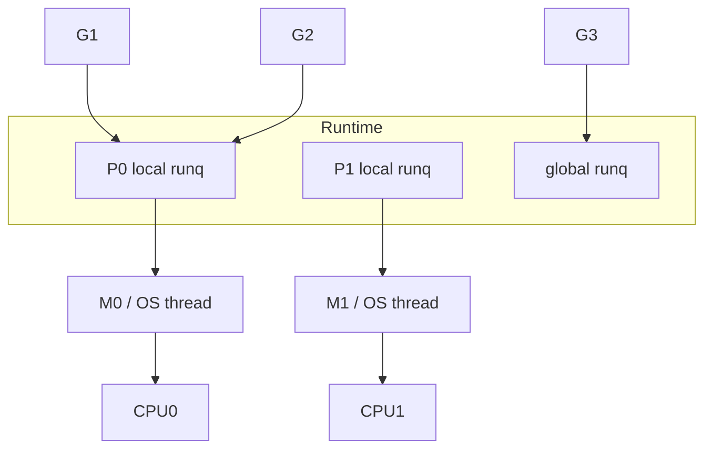
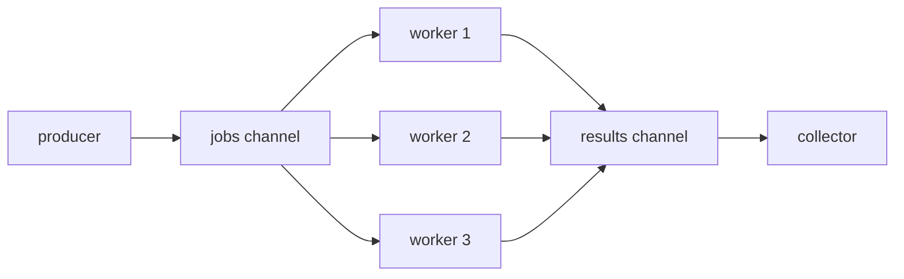
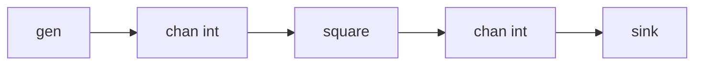

# Go 并发编程深度指南：Goroutine 与 Channel 原理全解析

> 面向系统学习者的 Go 并发底层指南。本文基于 Go 1.14+ 的调度器与 channel 实现，重点围绕 `g`、`m`、`p`、`hchan`、`sudog`、`selectgo` 等 runtime 结构展开。  
> 注意：Go runtime 内部字段会随版本调整，本文讲解的是核心模型与源码阅读路径，不是要求记忆每一个字段名。

---

## 目录

- [第一篇：Goroutine 深度解剖](#第一篇goroutine-深度解剖)
- [第二篇：Channel 深度解剖](#第二篇channel-深度解剖)
- [第三篇：实战与避坑指南](#第三篇实战与避坑指南)
- [源码阅读索引](#源码阅读索引)

---

# 第一篇：Goroutine 深度解剖

## 第 1 章：并发、并行与 Go 的协程选择

### 1.1 基础用法演示

```go
package main

import (
	"fmt"
	"time"
)

func main() {
	go func() {
		fmt.Println("hello from goroutine")
	}()

	time.Sleep(time.Second)
}
```

`go func() { ... }()` 的含义是：创建一个新的 goroutine，让 Go runtime 在合适的时机调度它运行。

这里必须强调：**goroutine 不是 OS thread**。goroutine 是 Go runtime 管理的用户态执行单元，最终会被调度到某个系统线程上执行。

### 1.2 并发与并行的区别

**并发 concurrency** 描述的是任务组织方式：

```text
多个任务在逻辑上同时推进。
```

**并行 parallelism** 描述的是实际执行方式：

```text
多个任务在物理 CPU 核上同时执行。
```

单核 CPU 可以并发，但不能真正并行：

```text
time slice 1: run goroutine A
time slice 2: run goroutine B
time slice 3: run goroutine A
time slice 4: run goroutine C
```

多核 CPU 才能并行：

```text
CPU0 -> goroutine A
CPU1 -> goroutine B
CPU2 -> goroutine C
CPU3 -> goroutine D
```

Go 的并发模型目标不是让你手动管理线程，而是让你表达：

```text
这几个任务可以独立推进。
```

至于它们具体在哪个线程、哪个 CPU 上运行，由 runtime 调度器负责。

### 1.3 为什么 Go 选择 goroutine，而不是直接暴露系统线程

系统线程的问题：

- 创建成本高。
- 栈空间通常较大。
- 线程切换需要进入内核调度。
- 大量阻塞线程会导致内核调度压力增大。
- 语言运行时很难对系统线程做细粒度调度优化。

goroutine 的目标：

- 初始栈小。
- 创建成本低。
- 由 Go runtime 调度。
- 阻塞网络 I/O 可以和 runtime netpoll 集成。
- 大量 goroutine 可以复用少量系统线程。

可以把 goroutine 和 thread 的关系理解为：

```text
goroutine: 业务级并发任务
thread:    OS 级执行载体
runtime:   把 goroutine 映射到 thread 上
```

### 1.4 底层源码与数据结构解析

Go runtime 里没有把 goroutine 直接交给 OS。它抽象了 GMP 模型：

```text
G = goroutine，用户态任务。
M = machine，系统线程。
P = processor，调度资源，持有本地运行队列。
```

关系图：


更准确的关系：

```text
G 要被执行，必须被某个 M 运行。
M 要运行 Go 代码，必须绑定一个 P。
P 的数量决定同时执行 Go 代码的并行度。
```

### 1.5 常见踩坑与避坑指南

**坑 1：把 goroutine 理解成线程。**

错误理解：

```text
go f() == 创建一个 OS thread
```

正确理解：

```text
go f() == 创建一个 G，把它交给 Go runtime 调度。
```

**坑 2：以为 goroutine 轻量就可以无限创建。**

goroutine 很轻，但不是免费：

- 有 `g` 结构体。
- 有栈。
- 有调度成本。
- 可能持有 channel、锁、网络连接、文件句柄。

**坑 3：主 goroutine 退出，其他 goroutine 也会被结束。**

```go
func main() {
	go func() {
		time.Sleep(time.Second)
		fmt.Println("never guaranteed")
	}()
}
```

`main` 函数返回后，整个进程结束。不要用 `time.Sleep` 作为严肃同步方案，应该使用 `sync.WaitGroup`、channel 或 context。

---

## 第 2 章：`go` 关键字底层发生了什么

### 2.1 基础用法演示

```go
go worker(10)
```

这行代码看起来像普通函数调用前加了一个 `go`，但语义完全不同。

普通函数调用：

```text
当前 goroutine 直接进入 worker，等待 worker 返回。
```

goroutine 调用：

```text
创建新 goroutine，把 worker 和参数包装成启动上下文，放入调度队列。
```

### 2.2 创建 goroutine 的 runtime 路径

核心路径大致如下：

```text
go worker(10)
    -> 编译器生成 runtime.newproc 调用
    -> runtime.newproc1 创建或复用 g
    -> 设置新 g 的入口 PC、参数、栈
    -> 把 g 放入当前 P 的本地 run queue
    -> 必要时唤醒空闲 M
```

ASCII 流程图：

```text
user code
   |
   | go f(x)
   v
runtime.newproc
   |
   v
new g object
   |
   v
P.local runq
   |
   v
scheduler picks G
   |
   v
M executes G
```

### 2.3 `go f(x)` 的参数什么时候求值

`go` 语句的函数值和参数会在当前 goroutine 中先求值，然后新 goroutine 再启动。

```go
for i := 0; i < 3; i++ {
	go fmt.Println(i)
}
```

这里 `fmt.Println` 和参数 `i` 会在执行 `go` 语句时求值。

但如果你写的是闭包：

```go
for i := 0; i < 3; i++ {
	go func() {
		fmt.Println(i)
	}()
}
```

Go 1.22 之前，闭包捕获的是同一个循环变量，容易出现所有 goroutine 看到同一个最终值的问题。Go 1.22 起，for 循环变量按每次迭代创建，显著降低了这个坑，但理解闭包捕获仍然很重要。

传统安全写法：

```go
for i := 0; i < 3; i++ {
	i := i
	go func() {
		fmt.Println(i)
	}()
}
```

或者：

```go
for i := 0; i < 3; i++ {
	go func(i int) {
		fmt.Println(i)
	}(i)
}
```

### 2.4 常见踩坑与避坑指南

**坑 1：以为 `go f()` 一定马上执行。**

`go f()` 只是让 `f` 进入可运行状态，不保证马上运行。

**坑 2：闭包捕获变量导致结果混乱。**

尤其在老版本 Go 或跨版本代码中，循环变量捕获要非常谨慎。

**坑 3：goroutine 内 panic 没有恢复会导致整个程序崩溃。**

```go
go func() {
	panic("boom")
}()
```

如果没有在这个 goroutine 内部 recover，panic 会导致整个进程退出。

---

## 第 3 章：GMP 模型核心结构

### 3.1 基础用法演示：`GOMAXPROCS`

```go
runtime.GOMAXPROCS(4)
```

这表示最多有 4 个 P 同时参与执行 Go 代码。

注意：

```text
GOMAXPROCS 控制 P 的数量。
GOMAXPROCS 不等于 goroutine 数量。
GOMAXPROCS 不严格等于 OS thread 数量。
```

### 3.2 `g` 结构体：goroutine 的 runtime 表示

源码位置：

```text
runtime/runtime2.go
type g struct { ... }
```

简化字段：

```go
type g struct {
	stack       stack
	stackguard0 uintptr
	stackguard1 uintptr

	_panic *_panic
	_defer *_defer

	m      *m
	sched  gobuf

	atomicstatus atomic.Uint32
	goid         uint64
	waitreason   waitReason
}
```

字段含义：

- `stack`：当前 goroutine 的栈范围。
- `stackguard0`：栈增长检查相关。
- `_panic`：panic 链表。
- `_defer`：defer 链表。
- `m`：当前运行它的 M。
- `sched`：保存被切走时的寄存器上下文。
- `atomicstatus`：当前状态。
- `goid`：内部 goroutine id。
- `waitreason`：阻塞原因，例如 channel receive、select、sleep。

`g` 的内存示意：

```text
+--------------------------------+
| g                              |
+--------------------------------+
| stack.lo / stack.hi            |
| stackguard0 / stackguard1      |
| sched.pc / sched.sp / sched.bp |
| atomicstatus                   |
| waitreason                     |
| m -> current M                 |
| _defer -> defer chain          |
| _panic -> panic chain          |
+--------------------------------+
```

常见状态：

```text
_Gidle      刚分配，未初始化
_Grunnable  可运行，等待调度
_Grunning   正在运行
_Gwaiting   阻塞等待
_Gsyscall   正在系统调用
_Gdead      已结束，可复用
```

### 3.3 `m` 结构体：OS thread 的 runtime 表示

源码位置：

```text
runtime/runtime2.go
type m struct { ... }
```

简化字段：

```go
type m struct {
	g0      *g
	curg    *g
	p       puintptr
	nextp   puintptr
	oldp    puintptr
	spinning bool
	lockedg guintptr
}
```

字段含义：

- `g0`：每个 M 都有一个特殊 goroutine，用来执行调度逻辑和栈管理逻辑。
- `curg`：当前 M 正在执行的普通 goroutine。
- `p`：当前绑定的 P。
- `nextp`：即将绑定的 P。
- `spinning`：是否正在自旋找任务。
- `lockedg`：与 `runtime.LockOSThread` 相关。

示意：

```text
+---------------------+
| M                   |
+---------------------+
| g0 -> scheduler G   |
| curg -> user G      |
| p -> current P      |
| nextp               |
| spinning            |
+---------------------+
```

`g0` 很关键：普通 goroutine 的栈会动态变化，而调度器需要一个稳定的系统栈执行调度、栈扩容、GC 辅助等 runtime 逻辑。

### 3.4 `p` 结构体：调度资源与本地队列

源码位置：

```text
runtime/runtime2.go
type p struct { ... }
```

简化字段：

```go
type p struct {
	id          int32
	status      uint32
	m           muintptr
	runqhead    uint32
	runqtail    uint32
	runq        [256]guintptr
	runnext     guintptr
	gFree       gList
}
```

字段含义：

- `id`：P 的编号。
- `status`：`_Pidle`、`_Prunning`、`_Psyscall` 等。
- `m`：当前绑定的 M。
- `runq`：本地 goroutine 队列。
- `runnext`：优先执行的下一个 G。
- `gFree`：可复用的 G 对象列表。

本地队列示意：

```text
+-----------------------------------+
| P                                 |
+-----------------------------------+
| runnext -> G0                     |
| runqhead                          |
| runqtail                          |
| runq: G1 G2 G3 G4 ...             |
| m -> M                            |
+-----------------------------------+
```

### 3.5 GMP 全景图



### 3.6 常见踩坑与避坑指南

**坑 1：误以为 P 是 CPU。**

P 不是 CPU。P 是 Go runtime 中的调度资源。P 的数量通常与 CPU 核数接近，但不是同一个概念。

**坑 2：误以为 M 数量不会超过 P。**

M 是 OS thread。阻塞 syscall、cgo、锁线程等场景可能导致 runtime 创建更多 M。

**坑 3：忽视 `LockOSThread` 的影响。**

`runtime.LockOSThread` 会把当前 goroutine 绑定到当前 OS thread，常用于 GUI、线程局部状态或 cgo 场景。误用会破坏调度器弹性。

---

## 第 4 章：调度策略全景图

### 4.1 基础用法演示

```go
for i := 0; i < 10000; i++ {
	go func() {
		doWork()
	}()
}
```

这些 goroutine 会进入调度系统。调度器要解决几个问题：

```text
谁先运行？
哪个 P 运行？
哪个 M 执行？
任务不均衡怎么办？
线程阻塞怎么办？
```

### 4.2 调度循环：`schedule`

源码阅读路径：

```text
runtime/proc.go
func schedule()
func findRunnable()
func execute()
```

简化流程：

```text
schedule:
    找一个可运行 G
    找不到则尝试 netpoll、全局队列、偷任务
    找到后 execute(g)

execute:
    把 G 状态改为 _Grunning
    设置 M.curg = G
    gogo(&G.sched)
```

调度循环示意：

```text
M.g0 scheduler stack
   |
   v
findRunnable()
   |
   +-- P.runnext
   +-- P.local runq
   +-- global runq
   +-- netpoll
   +-- steal from other P
   v
execute(G)
   |
   v
switch from g0 to user G
```

### 4.3 Work Stealing：工作窃取

问题：

```text
P0 队列很多任务，P1 没任务。
如果 P1 一直空闲，CPU 资源浪费。
```

解决：

```text
空闲 P 从其他 P 的本地队列偷一部分 G。
```

示意：

```text
before:

P0.runq: G1 G2 G3 G4 G5 G6
P1.runq:
P2.runq: G7
P3.runq:

P1 steals from P0

after:

P0.runq: G1 G2 G3
P1.runq: G4 G5 G6
P2.runq: G7
P3.runq:
```

Work Stealing 的意义：

- 避免所有 G 都进入全局队列导致锁竞争。
- 提高局部性。
- 自动平衡负载。

### 4.4 全局队列与本地队列

Go 调度器并不是只用本地队列。它还有全局运行队列。

常见策略：

```text
优先从当前 P 的本地 runq 取。
周期性检查全局 runq，避免全局任务饿死。
本地没有任务时，尝试从全局 runq、netpoll、其他 P 获取任务。
```

简化图：

```text
            +----------------+
            | global runq    |
            +----------------+
               ^        |
               |        v
+---------+  +---------+  +---------+
| P0 runq |  | P1 runq |  | P2 runq |
+---------+  +---------+  +---------+
```

### 4.5 Hand Off：阻塞 syscall 时的 P 交接

假设：

```text
P0 -> M0 -> G1
```

G1 执行阻塞系统调用：

```go
syscall.Read(fd, buf)
```

如果 M0 被内核阻塞，还继续持有 P0，那么 P0 上的其他 goroutine 就没法运行。  
所以 runtime 会让 M0 和 P0 分离。

```text
before:

P0 -> M0 -> G1

G1 enters blocking syscall:

M0 blocked in kernel
P0 detached

P0 -> M1 -> G2
```

这就是 hand off 的核心：

```text
阻塞的是 M，不应该拖住 P。
P 要交给其他 M，继续执行 Go 代码。
```

源码阅读路径：

```text
runtime/proc.go
entersyscall
exitsyscall
handoffp
retake
```

### 4.6 网络 I/O 与 netpoll

Go 的网络 I/O 通常不会为每个阻塞读写浪费一个 OS thread。runtime 会把 fd 注册到 netpoller。

简化流程：

```text
G wants to read socket
   |
   v
fd not ready
   |
   v
G parked, M runs other G
   |
   v
OS notifies fd ready
   |
   v
netpoll returns runnable G
   |
   v
G back to run queue
```

### 4.7 常见踩坑与避坑指南

**坑 1：用 goroutine 包装大量阻塞外部调用。**

如果阻塞调用不能被 Go netpoll 管理，例如某些 cgo 调用，可能造成大量 M 增长。

**坑 2：CPU 密集任务没有边界。**

Go 1.14+ 引入异步抢占后，长时间运行的 goroutine 更容易被抢占。但极端 tight loop 仍然可能影响延迟。CPU 密集任务要考虑分片、上下文取消和调度友好性。

**坑 3：认为调度顺序稳定。**

goroutine 执行顺序不稳定。依赖调度顺序就是 bug。

---

## 第 5 章：Goroutine 栈内存分配

### 5.1 基础用法演示

```go
func deep(n int) int {
	if n == 0 {
		return 0
	}
	return 1 + deep(n-1)
}
```

goroutine 的栈会随着调用深度变化自动增长。

### 5.2 动态栈扩缩容机制

goroutine 初始栈很小。函数调用前会检查是否有足够栈空间。

简化逻辑：

```text
function prologue:
    compare SP with stackguard
    if not enough:
        call morestack
```

栈增长：

```text
old stack:

+------------------+ high
| frame A          |
| frame B          |
| frame C          |
+------------------+ low

new stack:

+--------------------------------+ high
| copied frame A                 |
| copied frame B                 |
| copied frame C                 |
| more free stack space          |
+--------------------------------+ low
```

早期 Go 使用 segmented stack，后来改为 contiguous stack。连续栈扩容的核心是：

```text
分配更大的连续栈
复制旧栈内容
修正栈上指针
释放旧栈
```

### 5.3 栈为什么会影响逃逸分析

如果一个局部变量只在当前函数内使用，通常可以放在栈上：

```go
func f() int {
	x := 1
	return x + 1
}
```

如果局部变量的地址被返回：

```go
func f() *int {
	x := 1
	return &x
}
```

`x` 不能放在当前函数栈帧上，因为函数返回后栈帧失效。编译器会让它逃逸到堆上。

闭包也是类似：

```go
func counter() func() int {
	x := 0
	return func() int {
		x++
		return x
	}
}
```

返回出去的闭包还要访问 `x`，所以 `x` 的生命周期超过了 `counter` 的栈帧。

### 5.4 常见踩坑与避坑指南

**坑 1：深递归导致栈持续增长。**

goroutine 栈可以增长，但不是无限增长。深递归仍然可能压垮内存。

**坑 2：闭包持有大对象导致 GC 无法回收。**

```go
func f() func() {
	buf := make([]byte, 100<<20)
	return func() {
		_ = buf[0]
	}
}
```

只要返回的闭包还活着，`buf` 就可能还活着。

**坑 3：误以为栈上对象一定不会被 GC 扫描。**

GC 需要扫描 goroutine 栈，找到栈上的指针，再追踪堆对象。

---

# 第二篇：Channel 深度解剖

## 第 6 章：CSP 模型与 Channel 设计哲学

### 6.1 基础用法演示

```go
ch := make(chan int)

go func() {
	ch <- 42
}()

v := <-ch
fmt.Println(v)
```

channel 是 goroutine 之间通信和同步的机制。

### 6.2 CSP 是什么

CSP 是 Communicating Sequential Processes 的缩写，强调：

```text
独立的顺序执行实体，通过通信进行协作。
```

Go 里的说法是：

```text
Do not communicate by sharing memory;
instead, share memory by communicating.
```

中文不是简单翻译成“不要共享内存”。更准确地理解是：

```text
不要让多个 goroutine 随意读写同一份可变状态；
尽量通过消息传递明确数据所有权和状态变化。
```

### 6.3 Channel 与共享内存不是敌对关系

channel 底层本身就有共享内存：

```text
hchan 结构体
环形队列
等待队列
mutex
```

所以这句话不是在说“底层不用共享内存”，而是在说：

```text
业务层不要到处共享可变状态。
```

比如：

```text
共享内存方式：
    worker A/B/C 共同修改 map，需要 mutex。

channel 方式：
    只有 owner goroutine 持有 map，其他 goroutine 通过 channel 发请求。
```

### 6.4 常见踩坑与避坑指南

**坑 1：认为 channel 一定比 mutex 高级。**

如果目标是保护一个共享 map，mutex 可能更简单、更快、更清晰。

**坑 2：把指针通过 channel 发出去后继续改。**

```go
ch <- &obj
obj.Name = "changed"
```

如果接收者也在访问 `obj`，这仍然是共享内存竞争。

**坑 3：没有设计 channel 的所有权。**

要明确：

```text
谁发送？
谁接收？
谁关闭？
关闭表示什么？
退出信号如何传播？
```

---

## 第 7 章：无缓冲与有缓冲 Channel

### 7.1 基础用法演示

无缓冲 channel：

```go
ch := make(chan int)

go func() {
	ch <- 1
}()

v := <-ch
```

无缓冲 channel 的发送和接收必须同时配对。发送方必须等接收方，接收方也必须等发送方。

有缓冲 channel：

```go
ch := make(chan int, 2)

ch <- 1
ch <- 2
// ch <- 3 // buffer full, blocks
```

有缓冲 channel 可以暂存元素。

### 7.2 底层差异

无缓冲 channel：

```text
dataqsiz == 0
buf == nil or unused
发送和接收直接交接
```

示意：

```text
sender G stack slot ----copy----> receiver G stack slot
```

有缓冲 channel：

```text
dataqsiz > 0
buf points to ring buffer
sendx indicates next write slot
recvx indicates next read slot
qcount indicates buffered element count
```

示意：

```text
+-----------------------------------+
| buf[0] | buf[1] | buf[2] | buf[3] |
+-----------------------------------+
    ^                  ^
  recvx              sendx
```

### 7.3 常见踩坑与避坑指南

**坑 1：以为有缓冲 channel 不会阻塞。**

缓冲区满时，发送阻塞。缓冲区空时，接收阻塞。

**坑 2：用大 buffer 掩盖下游消费能力不足。**

```go
jobs := make(chan Job, 100000)
```

这可能只是把问题从“阻塞”变成“内存增长”。

**坑 3：把 channel 容量当作业务持久队列。**

channel 是进程内同步结构，不是持久消息队列。

---

## 第 8 章：`runtime.hchan` 结构体深拆

### 8.1 基础用法演示

```go
ch := make(chan string, 4)
```

这会在 runtime 中创建一个 `hchan`。

### 8.2 `hchan` 简化源码映射

源码位置：

```text
runtime/chan.go
type hchan struct { ... }
```

简化结构：

```go
type hchan struct {
	qcount   uint
	dataqsiz uint
	buf      unsafe.Pointer
	elemsize uint16
	closed   uint32
	timer    *timer
	elemtype *_type
	sendx    uint
	recvx    uint
	recvq    waitq
	sendq    waitq
	lock     mutex
}
```

字段解释：

- `qcount`：当前缓冲区已有元素数量。
- `dataqsiz`：缓冲区容量。
- `buf`：环形队列内存地址。
- `elemsize`：元素大小。
- `closed`：channel 是否关闭。
- `elemtype`：元素类型。
- `sendx`：下一次发送写入位置。
- `recvx`：下一次接收读取位置。
- `recvq`：等待接收的 goroutine 队列。
- `sendq`：等待发送的 goroutine 队列。
- `lock`：保护 hchan 内部状态的互斥锁。

整体内存布局：

```text
+-----------------------------------------------------+
| hchan                                               |
+-----------------------------------------------------+
| qcount: 2                                           |
| dataqsiz: 4                                         |
| buf ----------------------+                         |
| sendx: 2                  |                         |
| recvx: 0                  v                         |
| recvq -> waitq         +-------------------------+  |
| sendq -> waitq         | ring buffer             |  |
| lock                   | [A] [B] [_] [_]         |  |
+------------------------+-------------------------+--+
```

等待队列：

```text
recvq:
    sudog(G7) -> sudog(G8)

sendq:
    sudog(G3) -> sudog(G4)
```

### 8.3 `waitq` 与 `sudog`

源码位置：

```text
runtime/runtime2.go
type sudog struct { ... }
```

简化结构：

```go
type sudog struct {
	g        *g
	next     *sudog
	prev     *sudog
	elem     unsafe.Pointer
	c        *hchan
	isSelect bool
	success  bool
}
```

`sudog` 的作用：

```text
表示某个 goroutine 正在某个同步对象上等待。
```

对于 channel：

```text
接收阻塞时：sudog 挂入 hchan.recvq。
发送阻塞时：sudog 挂入 hchan.sendq。
select 阻塞时：同一个 G 可能通过多个 sudog 挂到多个 channel。
```

### 8.4 为什么 channel 里有锁

channel 需要保护：

```text
qcount
sendx
recvx
closed
sendq
recvq
buffer slots
```

所以 `hchan.lock` 是必须的。  
Go 的 channel 是并发安全的，根本原因就是 runtime 在 channel 操作内部做了同步。

### 8.5 常见踩坑与避坑指南

**坑 1：复制 channel 变量不会复制底层 hchan。**

```go
ch2 := ch
```

`ch` 和 `ch2` 指向同一个 `hchan`。

**坑 2：channel 保护的是发送接收，不保护元素内部。**

```go
type Data struct {
	M map[string]int
}

ch <- data
```

如果多个 goroutine 同时访问 `data.M`，仍然需要同步。

---

## 第 9 章：发送数据的底层三大情景

### 9.1 基础用法演示

```go
ch <- v
```

发送操作进入 runtime 后，大致对应：

```text
runtime.chansend
```

### 9.2 快速失败检查

发送前要处理特殊情况：

```text
channel == nil       -> 永久阻塞
channel 已关闭       -> panic
非阻塞发送且不能发送 -> 返回 false
```

例如：

```go
var ch chan int
ch <- 1 // blocks forever
```

```go
ch := make(chan int)
close(ch)
ch <- 1 // panic: send on closed channel
```

### 9.3 情景一：有等待接收者，直接发送

条件：

```text
recvq 不为空
```

说明有 goroutine 已经阻塞在接收操作上。

流程：

```text
1. 发送方获取 hchan.lock。
2. 从 recvq 出队一个 sudog。
3. 直接把发送值复制到接收者的目标地址。
4. 把接收者 G 变为 runnable。
5. 释放 hchan.lock。
```

示意：

```text
sender stack:
    v = 42
      |
      | typedmemmove
      v
receiver sudog.elem:
    &recvVar
```

此时不经过环形队列。

### 9.4 情景二：没有等待接收者，但缓冲区未满

条件：

```text
recvq 为空
qcount < dataqsiz
```

流程：

```text
1. 获取 hchan.lock。
2. 把元素复制到 buf[sendx]。
3. sendx = (sendx + 1) % dataqsiz。
4. qcount++。
5. 释放 hchan.lock。
```

示意：

```text
before:

buf: [A] [B] [_] [_]
              ^
            sendx
qcount = 2

send C:

buf: [A] [B] [C] [_]
                  ^
                sendx
qcount = 3
```

### 9.5 情景三：没有接收者，缓冲区已满，发送方阻塞

条件：

```text
recvq 为空
qcount == dataqsiz
```

流程：

```text
1. 获取 hchan.lock。
2. 创建 sudog。
3. sudog.g = 当前 G。
4. sudog.elem = 发送值地址。
5. sudog.c = 当前 hchan。
6. 把 sudog 挂入 sendq。
7. 当前 G 调用 gopark 休眠。
8. 释放锁并切换到调度器。
```

示意：

```text
sendq:
    sudog{g: G12, elem: &value}
        |
        v
    sudog{g: G15, elem: &value2}
```

发送方被唤醒后，需要检查：

```text
是不是因为正常接收被唤醒？
是不是因为 channel close 被唤醒？
```

如果是 close 唤醒，发送方会 panic。

### 9.6 常见踩坑与避坑指南

**坑 1：发送方无人接收导致泄漏。**

```go
func leak() {
	ch := make(chan int)
	go func() {
		ch <- 1
	}()
}
```

这个 goroutine 会永久阻塞。

**坑 2：多个发送者时随意 close。**

```go
close(ch)
ch <- 1
```

只要还有发送者可能发送，就不能关闭。

**坑 3：发送大对象导致复制成本高。**

channel 发送会复制元素。大对象通常传指针，但传指针后要重新考虑所有权和并发安全。

---

## 第 10 章：接收数据的底层情景

### 10.1 基础用法演示

```go
v := <-ch
```

或者：

```go
v, ok := <-ch
```

`ok` 表示是否从未关闭的 channel 中成功接收到值。

### 10.2 情景一：有等待发送者

条件：

```text
sendq 不为空
```

#### 无缓冲 channel

无缓冲 channel 没有队列，接收者直接从发送者的 `sudog.elem` 拷贝数据。

```text
sender sudog.elem ----copy----> receiver variable
```

然后唤醒发送者。

#### 有缓冲 channel

有缓冲 channel 且 sendq 不为空，通常意味着缓冲区已满。接收者先从 buffer 取一个元素，再把等待发送者的元素放入 buffer。

示意：

```text
before:

buf: [A] [B] [C]
recvx -> A
sendq -> sender wants to send D

receive:
    receiver gets A
    D goes into freed slot

after:

buf: [D] [B] [C]
recvx -> B
sender awakened
```

这样可以保持 FIFO 语义。

### 10.3 情景二：缓冲区有数据

条件：

```text
qcount > 0
```

流程：

```text
1. 获取 hchan.lock。
2. 从 buf[recvx] 复制元素到接收变量。
3. 清空 buf[recvx]。
4. recvx = (recvx + 1) % dataqsiz。
5. qcount--。
6. 释放锁。
```

示意：

```text
before:

buf: [A] [B] [_] [_]
      ^
    recvx
qcount = 2

receive A:

buf: [_] [B] [_] [_]
          ^
        recvx
qcount = 1
```

### 10.4 情景三：无数据且未关闭，接收方阻塞

条件：

```text
qcount == 0
sendq 为空
closed == false
```

流程：

```text
1. 创建 sudog。
2. sudog.g = 当前 G。
3. sudog.elem = 接收变量地址。
4. 把 sudog 挂入 recvq。
5. 当前 G gopark 休眠。
```

等待发送者或 close 唤醒。

### 10.5 情景四：channel 已关闭且缓冲区为空

```go
v, ok := <-ch
```

结果：

```text
v = 元素类型零值
ok = false
```

如果 channel 已关闭但 buffer 还有数据：

```text
先正常接收 buffer 中的数据，ok = true。
buffer 取完后，再接收才 ok = false。
```

### 10.6 常见踩坑与避坑指南

**坑 1：从 closed channel 接收不会 panic。**

```go
close(ch)
v, ok := <-ch
```

这是合法操作。

**坑 2：range channel 需要 close 才能结束。**

```go
for v := range ch {
	fmt.Println(v)
}
```

没有 close，range 会一直等。

**坑 3：忽略 `ok` 导致零值歧义。**

```go
v := <-ch
```

如果 `v` 是 `0`，你无法知道这是正常发送的 `0`，还是关闭后返回的零值。需要：

```go
v, ok := <-ch
```

---

## 第 11 章：关闭 Channel 的底层动作

### 11.1 基础用法演示

```go
close(ch)
```

关闭 channel 表示：

```text
不会再有新值发送进来。
接收者仍然可以取完缓冲区已有数据。
缓冲区取空后，接收返回零值和 ok=false。
```

### 11.2 `closechan` 底层流程

源码位置：

```text
runtime/chan.go
func closechan(c *hchan)
```

简化流程：

```text
1. 如果 c == nil，panic。
2. 获取 c.lock。
3. 如果 c.closed != 0，panic。
4. 设置 c.closed = 1。
5. 唤醒 recvq 中所有接收者。
6. 唤醒 sendq 中所有发送者。
7. 释放 c.lock。
8. 把被唤醒的 G 放入可运行队列。
```

广播示意：

```text
close(ch)

recvq:
    G1 G2 G3
      \ | /
       wake all, receive zero value, ok=false

sendq:
    G4 G5
      \ /
       wake all, panic: send on closed channel
```

### 11.3 close 为什么像广播

close 不是发送一个特殊值。close 是改变 channel 状态，并唤醒所有等待者。

这意味着：

```text
所有阻塞接收者都能醒来。
所有之后的接收也不会再阻塞。
所有阻塞发送者会被唤醒并 panic。
所有之后的发送也会 panic。
```

### 11.4 常见踩坑与避坑指南

**坑 1：重复 close。**

```go
close(ch)
close(ch) // panic
```

**坑 2：关闭 nil channel。**

```go
var ch chan int
close(ch) // panic
```

**坑 3：接收方关闭 channel。**

一般规则：

```text
谁负责发送，谁负责关闭。
```

如果多个 goroutine 都在发送，应由额外协调者在确认所有发送者退出后关闭。

---

# 第三篇：实战与避坑指南

## 第 12 章：Select 机制底层实现

### 12.1 基础用法演示

```go
select {
case v := <-ch1:
	fmt.Println("recv", v)
case ch2 <- 10:
	fmt.Println("send")
case <-time.After(time.Second):
	fmt.Println("timeout")
default:
	fmt.Println("nothing ready")
}
```

`select` 用来同时等待多个 channel 操作。

### 12.2 `selectgo` 底层流程

源码位置：

```text
runtime/select.go
func selectgo(...)
```

简化流程：

```text
1. 收集所有 case。
2. 生成随机 poll order，避免固定优先级导致饥饿。
3. 按 channel 地址生成 lock order，避免多 channel 加锁死锁。
4. 第一轮扫描：是否有立即可执行的 case。
5. 如果有，执行并返回。
6. 如果没有可执行 case，但有 default，执行 default。
7. 如果没有 default，构造 sudog，挂入各个 channel 的 sendq/recvq。
8. 当前 G gopark 阻塞。
9. 某个 channel 操作唤醒该 G。
10. G 被调度后，从其他 channel 等待队列撤销 sudog。
11. 执行命中的 case。
```

select 阻塞示意：

```text
G waiting on select

case <-ch1:
    sudog A -> ch1.recvq

case ch2 <- v:
    sudog B -> ch2.sendq

case <-ch3:
    sudog C -> ch3.recvq
```

当 `ch2` 可发送时：

```text
ch2 wakes G
G removes sudog A from ch1.recvq
G removes sudog C from ch3.recvq
G executes case ch2 <- v
```

### 12.3 select 的公平性

select 会对 case 的轮询顺序做伪随机化。目的不是严格公平，而是避免：

```text
前面的 case 永远优先，后面的 case 长期饥饿。
```

### 12.4 nil channel 在 select 中的作用

nil channel 的发送和接收会永久阻塞。

在 select 中，这常用于动态禁用某个 case：

```go
var out chan<- int

if ready {
	out = ch
}

select {
case out <- v:
	// only enabled when ready
case <-ctx.Done():
	return
}
```

### 12.5 常见踩坑与避坑指南

**坑 1：`select {}` 永久阻塞。**

```go
select {}
```

这会让当前 goroutine 永久休眠。

**坑 2：default 造成忙轮询。**

```go
for {
	select {
	case v := <-ch:
		handle(v)
	default:
	}
}
```

这会疯狂消耗 CPU。可以改为阻塞等待、使用 ticker，或重新设计数据流。

**坑 3：`time.After` 在循环中反复创建 timer。**

```go
for {
	select {
	case <-time.After(time.Second):
	}
}
```

高频循环中应优先考虑复用 `time.Timer` 或 `time.Ticker`。

---

## 第 13 章：Goroutine 泄漏图谱

### 13.1 基础示例：发送无人接收

```go
func leak() {
	ch := make(chan int)

	go func() {
		ch <- 1
	}()
}
```

这个 goroutine 会永久阻塞在发送操作上。

### 13.2 泄漏场景一：接收无人发送

```go
func leak() {
	ch := make(chan int)

	go func() {
		v := <-ch
		fmt.Println(v)
	}()
}
```

没有发送者，也没有 close，接收者永久阻塞。

### 13.3 泄漏场景二：range 永不结束

```go
func worker(ch <-chan int) {
	for v := range ch {
		fmt.Println(v)
	}
}
```

如果没人关闭 `ch`，worker 永远等下一个值。

### 13.4 泄漏场景三：下游提前退出，上游阻塞

```go
func gen() <-chan int {
	out := make(chan int)
	go func() {
		for i := 0; ; i++ {
			out <- i
		}
	}()
	return out
}

func main() {
	ch := gen()
	fmt.Println(<-ch)
}
```

`main` 只接收一个值后退出当前逻辑，但生成 goroutine 还在继续发送。

修复方式：

```go
func gen(ctx context.Context) <-chan int {
	out := make(chan int)
	go func() {
		defer close(out)
		for i := 0; ; i++ {
			select {
			case <-ctx.Done():
				return
			case out <- i:
			}
		}
	}()
	return out
}
```

### 13.5 泄漏排查方法

使用 pprof：

```go
pprof.Lookup("goroutine").WriteTo(os.Stdout, 2)
```

重点观察栈顶：

```text
chan send
chan receive
select
sync.Cond.Wait
sync.Mutex.Lock
net/http.(*persistConn).readLoop
```

运行时也可以用：

```bash
go tool pprof http://localhost:6060/debug/pprof/goroutine
```

### 13.6 常见踩坑与避坑指南

**坑 1：没有取消信号。**

长期 goroutine 应该监听 `context.Context`。

**坑 2：只关闭输入，不关闭输出。**

pipeline 每一阶段都应该在退出时关闭自己的输出 channel。

**坑 3：worker pool 没有回收机制。**

worker 应该在 `jobs` 关闭或 `ctx.Done()` 时退出。

---

## 第 14 章：Channel Panic 与 Deadlock 总结

### 14.1 会 panic 的情况

#### 向 closed channel 发送

```go
ch := make(chan int)
close(ch)
ch <- 1
```

结果：

```text
panic: send on closed channel
```

#### 关闭 closed channel

```go
close(ch)
close(ch)
```

结果：

```text
panic: close of closed channel
```

#### 关闭 nil channel

```go
var ch chan int
close(ch)
```

结果：

```text
panic: close of nil channel
```

### 14.2 不 panic 但会阻塞的情况

#### 向 nil channel 发送

```go
var ch chan int
ch <- 1
```

永久阻塞。

#### 从 nil channel 接收

```go
var ch chan int
v := <-ch
```

永久阻塞。

#### 无缓冲 channel 没有配对方

```go
ch := make(chan int)
ch <- 1
```

如果没有其他 goroutine 接收，会阻塞。

### 14.3 deadlock 典型场景

```go
func main() {
	ch := make(chan int)
	ch <- 1
}
```

主 goroutine 阻塞，没有其他 goroutine 可运行，runtime 报：

```text
fatal error: all goroutines are asleep - deadlock!
```

注意：不是所有阻塞都会立刻报 deadlock。只要 runtime 认为还有可能被唤醒，例如 timer、netpoll、其他 goroutine，程序可能继续等待。

### 14.4 Channel 行为矩阵

| 操作 | nil channel | open channel | closed channel |
|---|---:|---:|---:|
| send | 永久阻塞 | 可能成功或阻塞 | panic |
| receive | 永久阻塞 | 可能成功或阻塞 | 立即返回零值，`ok=false`，或先取 buffer |
| close | panic | 成功 | panic |

### 14.5 常见踩坑与避坑指南

**坑 1：多个发送者共同关闭 channel。**

应该使用 `sync.WaitGroup` 等待所有发送者结束，再由唯一 goroutine close。

**坑 2：把 close 当作发送结束值。**

close 是状态变化，不是普通数据。需要业务结束值时可以发送结构体：

```go
type Event struct {
	Value int
	Done  bool
}
```

**坑 3：用 recover 掩盖 send on closed channel。**

这通常说明 channel 所有权设计错误。

---

## 第 15 章：高级并发范式

### 15.1 Worker Pool

#### 基础用法演示

```go
type Job struct {
	ID int
}

type Result struct {
	JobID int
	Value int
}

func worker(ctx context.Context, id int, jobs <-chan Job, results chan<- Result) {
	for {
		select {
		case <-ctx.Done():
			return
		case job, ok := <-jobs:
			if !ok {
				return
			}
			results <- Result{
				JobID: job.ID,
				Value: job.ID * 2,
			}
		}
	}
}

func run(ctx context.Context, input []Job) []Result {
	jobs := make(chan Job)
	results := make(chan Result)

	const workerCount = 4

	var wg sync.WaitGroup
	wg.Add(workerCount)

	for i := 0; i < workerCount; i++ {
		go func(id int) {
			defer wg.Done()
			worker(ctx, id, jobs, results)
		}(i)
	}

	go func() {
		defer close(jobs)
		for _, job := range input {
			select {
			case <-ctx.Done():
				return
			case jobs <- job:
			}
		}
	}()

	go func() {
		wg.Wait()
		close(results)
	}()

	var out []Result
	for r := range results {
		out = append(out, r)
	}
	return out
}
```

#### 底层逻辑

```text
producer -> jobs channel -> N workers -> results channel -> collector
```

图示：



Worker Pool 解决的是：

```text
任务很多，但并发度要受控。
```

#### 常见踩坑与避坑指南

**坑 1：results 没人接收导致 worker 阻塞。**

如果 worker 发送结果，但 collector 不消费，worker 会泄漏。

**坑 2：忘记关闭 results。**

collector range results 会永远等待。

**坑 3：context 取消时发送方仍阻塞。**

发送 jobs、发送 results 都要考虑 `ctx.Done()`。

### 15.2 Pipeline

#### 基础用法演示

```go
func gen(ctx context.Context, nums ...int) <-chan int {
	out := make(chan int)
	go func() {
		defer close(out)
		for _, n := range nums {
			select {
			case <-ctx.Done():
				return
			case out <- n:
			}
		}
	}()
	return out
}

func square(ctx context.Context, in <-chan int) <-chan int {
	out := make(chan int)
	go func() {
		defer close(out)
		for n := range in {
			select {
			case <-ctx.Done():
				return
			case out <- n * n:
			}
		}
	}()
	return out
}

func main() {
	ctx, cancel := context.WithCancel(context.Background())
	defer cancel()

	for v := range square(ctx, gen(ctx, 1, 2, 3, 4)) {
		fmt.Println(v)
	}
}
```

#### 底层逻辑

```text
stage 1 owns its output channel
stage 2 ranges stage 1 output
stage 2 owns its output channel
downstream cancellation propagates through context
```

图示：



#### 常见踩坑与避坑指南

**坑 1：下游提前退出，上游阻塞发送。**

必须用 context 或 done channel 传递取消信号。

**坑 2：多个上游 fan-in 时关闭时机错误。**

需要用 `WaitGroup` 确认所有上游转发 goroutine 结束后再 close 输出。

**坑 3：pipeline 中无限 buffer。**

这会把背压机制破坏掉，导致内存不可控。

---

## 第 16 章：Mutex、Cond、Channel 的选择边界

### 16.1 基础用法对比

共享 map：

```go
var mu sync.Mutex
table := map[string]string{}

mu.Lock()
table["k"] = "v"
mu.Unlock()
```

消息传递：

```go
type Request struct {
	Key   string
	Value string
	Resp  chan string
}

reqCh := make(chan Request)
```

### 16.2 选择原则

```text
数据所有权可以流动 -> channel
多个 goroutine 必须共享同一份状态 -> mutex
线程要等待某个条件变化 -> mutex + cond
限制同时执行数量 -> semaphore / worker pool
生命周期取消 -> context
```

### 16.3 条件变量不是“值大于 1 的锁”

`sync.Cond` 是等待队列，不是计数器。

```go
mu.Lock()
for !condition() {
	cond.Wait()
}
// condition true, use shared state
mu.Unlock()
```

`Wait` 的关键动作：

```text
1. 当前 goroutine 必须持有锁。
2. Wait 原子地释放锁并睡眠。
3. 被 Signal/Broadcast 唤醒。
4. Wait 返回前重新获取锁。
```

所以不会出现“被唤醒者绕过 mutex 进入临界区”的情况。

### 16.4 常见踩坑与避坑指南

**坑 1：用 `if` 包裹 `cond.Wait`。**

错误：

```go
if !condition() {
	cond.Wait()
}
```

正确：

```go
for !condition() {
	cond.Wait()
}
```

因为唤醒不等于条件一定满足。

**坑 2：先 Signal 后修改条件。**

错误：

```go
cond.Signal()
ready = true
```

正确：

```go
ready = true
cond.Signal()
```

通常放在同一把锁保护下。

---

# 源码阅读索引

建议按以下顺序读 Go runtime 源码：

1. `runtime/runtime2.go`
   - `type g struct`
   - `type m struct`
   - `type p struct`
   - `type sudog struct`

2. `runtime/proc.go`
   - `newproc`
   - `newproc1`
   - `schedule`
   - `findRunnable`
   - `execute`
   - `handoffp`
   - `entersyscall`
   - `exitsyscall`

3. `runtime/chan.go`
   - `type hchan struct`
   - `makechan`
   - `chansend`
   - `chanrecv`
   - `closechan`

4. `runtime/select.go`
   - `selectgo`

5. `runtime/stack.go`
   - `morestack`
   - `newstack`
   - stack growth / shrink 相关逻辑

官方源码入口：

- https://go.dev/src/runtime/runtime2.go
- https://go.dev/src/runtime/proc.go
- https://go.dev/src/runtime/chan.go
- https://go.dev/src/runtime/select.go
- https://go.dev/src/runtime/stack.go

---

# 最终总结

Go 并发系统可以浓缩成几条主线：

```text
goroutine 是用户态执行单元。
GMP 是 runtime 把 goroutine 映射到 OS thread 的调度模型。
channel 是带锁、环形队列和等待队列的同步通信结构。
sudog 是 goroutine 挂到同步对象等待队列上的 runtime 节点。
select 是把一个 goroutine 同时挂到多个 channel 等待队列上的多路复用机制。
context、WaitGroup、Mutex、Cond、Channel 分别解决不同层面的并发问题。
```

工程上最重要的判断不是“channel 好还是 mutex 好”，而是：

```text
谁拥有数据？
谁负责关闭？
谁能阻塞？
谁负责取消？
谁保证退出？
```

只要这五个问题没有设计清楚，goroutine 泄漏、channel deadlock、send on closed channel、数据竞争都会在真实系统里反复出现。
